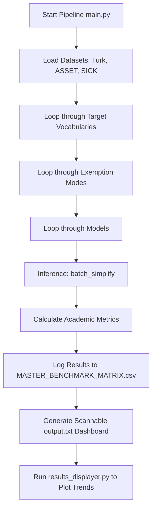

# 📊 Lexical-Constrained Text Simplification Evaluation Matrix

This project implements a highly optimized benchmark evaluation pipeline for **Lexical-Constrained Text Simplification**. The core goal is to evaluate, compare, and visualize how different natural language processing models perform when forced to simplify sentences using only a restricted **Core Vocabulary** (plus optional grammatical/functional exempt words).

---

## 🎯 Project Goal

When generating simplified text, standard models often introduce complex words or out-of-vocabulary (OOV) terms. This project restricts models to generating text where **every single word** (excluding optional punctuation and stopwords) resides in a predefined dictionary. 

The evaluation framework automatically runs a multi-dimensional sweep over:
1. **Target Vocabularies**: Ranging from custom lists (e.g., *Randall Munroe's Thing Explainer 1000*, *Ogden's Basic English 850*) to dynamically sized vocabularies from 100 to 2000 words.
2. **Exemption Modes**: Strategies determining whether common stopwords and punctuation are exempt from constraints.
3. **NLP Simplification Architectures**: Four different paradigms representing token substitution, prefix-constrained seq2seq decoding, character-level trie decoding, and vector-space embedding substitution.
4. **Benchmark Datasets**: Multi-reference simplification test sets and meaning-preservation datasets.

---

## ⚙️ Project Architecture & Workflow

Below is the workflow of the evaluation matrix system:



---

## 🤖 Models & Approaches

We evaluate four distinct constrained simplification models located under the `src/` directory:

### 1. MLM (Masked Language Model) — [MLMNeuralSimplifier](file:///c:/Users/royha/Documents/Uni/CoreVocabulary/NewApproach/src/MLM_model.py#L29)
* **Base Model**: `distilbert-base-uncased`
* **Approach**: Single-pass template and token substitution.
* **Mechanism**: 
  1. Identifies OOV words in the sentence and masks them one by one.
  2. Runs a single forward pass on the MLM to compute logits over the masked token.
  3. Uses a custom [CoreVocabularyLogitsProcessor](file:///c:/Users/royha/Documents/Uni/CoreVocabulary/NewApproach/src/MLM_model.py#L5) to zero out (`-inf` mask) all vocabulary tokens not in the target core vocabulary or exempt set.
  4. Compares single-token vocabulary matches against multi-token vocabulary words (which are scored by summing their subword token log-probabilities) to output the best valid substitution.

### 2. T5 (Seq2Seq Subword Trie) — [DynamicT5Simplifier](file:///c:/Users/royha/Documents/Uni/CoreVocabulary/NewApproach/src/t5_model.py#L24)
* **Base Model**: `t5-small`
* **Approach**: Prefix-constrained sequence-to-sequence translation.
* **Mechanism**: 
  1. Builds a [T5SubwordTrie](file:///c:/Users/royha/Documents/Uni/CoreVocabulary/NewApproach/src/t5_model.py#L4) of the allowed vocabulary using the T5 tokenizer.
  2. Leverages Hugging Face's `prefix_allowed_tokens_fn` callback during beam search decoding.
  3. Ensures that at each generation step, the model only generates subword tokens that form prefix paths toward valid words in the target core vocabulary.

### 3. ByT5 (Character Trie Decoder) — [CharacterTrieNeuralSimplifier](file:///c:/Users/royha/Documents/Uni/CoreVocabulary/NewApproach/src/byt5_model.py#L24)
* **Base Model**: `google/byt5-small`
* **Approach**: Positive constrained character-level Seq2Seq generation.
* **Mechanism**:
  1. Constructs a character-level [VocabularyTrie](file:///c:/Users/royha/Documents/Uni/CoreVocabulary/NewApproach/src/byt5_model.py#L9) from the target core vocabulary.
  2. The custom `prefix_allowed_tokens_fn` decodes character by character.
  3. Restricts the next allowed character byte representation to valid children of the current trie node. If the current character sequence constitutes a valid word, a space character is allowed to start a new word path from the root.

### 4. EMB_SUB (Embedding Vector Substitution) — [EmbeddingSubstitutionModel](file:///c:/Users/royha/Documents/Uni/CoreVocabulary/NewApproach/src/original_model.py#L6)
* **Base Model**: `distilbert-base-uncased` (Embedding layer)
* **Approach**: Classical vector-space cosine similarity mapping.
* **Mechanism**:
  1. Extracts and L2-normalizes the mean-pooled token embedding vectors for all words in the allowed vocabulary at load time.
  2. For any OOV word in a sentence, extracts its embedding and performs a highly optimized matrix dot-product (matrix multiplication) against the pre-compiled vocabulary matrix.
  3. Replaces the OOV word with the nearest neighbor cosine match while preserving word casing.

---

## 📊 Datasets & Evaluation Metrics

### Datasets
* **Turk Corpus**: A standard text simplification dataset (GEM/wiki_auto_asset_turk split test_turk) containing original sentences paired with human simplifications.
* **Asset**: An alternative split of the same corpus containing multiple highly diverse human simplification references per sentence.
* **SICK (Sentence Involvement & Compositional Knowledge)**: Evaluates semantic similarity and meaning preservation. The length of the evaluation split is controlled via `SICK_SLICING` (default: 400 sentences).

### Metrics
All metrics are implemented in [SimplificationEvaluator](file:///c:/Users/royha/Documents/Uni/CoreVocabulary/NewApproach/src/evaluator.py#L23):
* **SARI**: Measures the quality of word additions, deletions, and retentions compared to references.
* **BLEU**: Measures n-gram overlap between predictions and references.
* **METEOR**: Captures synonym and stem-based matches using NLTK WordNet.
* **BERTScore (F1)**: Computes contextual token embedding similarity with reference sentences.
* **Cosine Similarity**: Measures meaning preservation by computing the contextual similarity between predictions and the original source sentence.
* **Jaccard Similarity**: Calculates token-level intersection over union (IoU) with the original source sentence.
* **Compression Ratio**: Ratio of the predicted word count to the source word count.

---

## ⚙️ Exemption Configurations

Exemptions are configured in [configuration.py](file:///c:/Users/royha/Documents/Uni/CoreVocabulary/NewApproach/src/configuration.py):
* `english_stopwords`: NLTK's English stopword corpus and standard punctuation marks (e.g. `.,!?;:`) are exempt from core vocabulary checks. OOV words that are stopwords will not be substituted.
* `none`: No exemptions are allowed except basic punctuation. Stopwords must be mapped into the target core vocabulary.

---

## 🚀 Setup & Installation Guide

### Prerequisites
* **Python**: `3.11.9` is required.

### Installation Steps

1. **Clone the repository and navigate to the directory**:
   ```bash
   cd NewApproach
   ```

2. **Set up a virtual environment (Recommended)**:
   ```bash
   python -m venv venv
   # On Windows:
   .\venv\Scripts\activate
   # On macOS/Linux:
   source venv/bin/activate
   ```

3. **Install the dependencies**:
   ```bash
   pip install -r requirements.txt
   ```
   *Note: This will install core libraries including `transformers`, `torch`, `sacrebleu`, `nltk`, `scikit-learn`, and Hugging Face `datasets`.*

4. **NLTK Resource Files**:
   The scripts will automatically check and download the required NLTK resources (`stopwords`, `wordnet`, `punkt_tab`, `omw-1.4`) during execution.

---

## 🖥️ How to Run

### 1. Configure the Run
Open [src/configuration.py](file:///c:/Users/royha/Documents/Uni/CoreVocabulary/NewApproach/src/configuration.py) to enable/disable specific models, target vocabularies, exemption modes, datasets, or customize `SICK_SLICING`.

### 2. Run the Benchmark Matrix
Execute the main script:
```bash
python main.py
```
This runs the entire configuration loop. As it runs:
* It prints real-time updates and estimated completion times.
* It outputs progress logs into `MASTER_BENCHMARK_MATRIX.csv`.
* Once finished, it compiles a human-scannable runtime dashboard matrix in `output.txt`.

### 3. Generate Evaluation Plots
To visualize metric trends and compression ratios across the vocabulary scale:
```bash
python src/results_displayer.py
```
This reads the final `MASTER_BENCHMARK_MATRIX.csv` and outputs trend line graphs to the `plots/` directory, grouped by model, dataset, and exemption mode.
